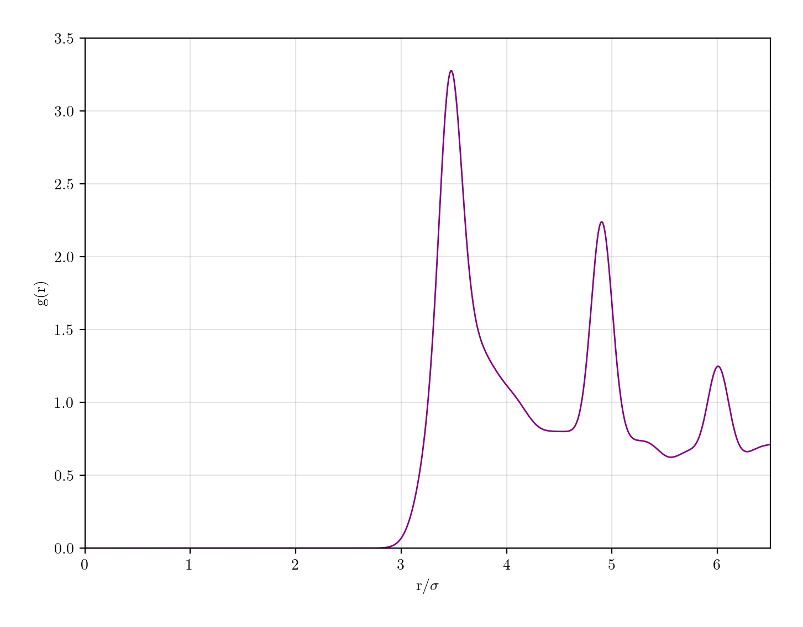

# Metropolis Monte Carlo Simulation in a Lennard Jones Potential
The purpose of this project is to simulate a system of N particles interacting with a Lennard Jones potential and obeying classical equations of motion. Several parameters can be set by the user, including the number of particles, the density and temperature of the liquid, the maximum displacement, the number of relaxation timesteps and the number of simulation timesteps. Periodic boundary conditions have been implemented. Because of the computational complexity of the problem, I would advise to keep the number of particles below 1000. 

This problem was first studied in the paper *Correlations in the Motion of Atoms in Liquid Argon* in 1964. Using N = 864, $\rho$ = 1374 $kg/m^3$ and T = 94.4 $K$, we can reproduce the pair correlation plot reported in the original paper:

    

As the initial configuration is close to a stable equilibrium, the number of simulation timesteps required is 1 million or more, as the system takes quite a long time to evolve from the initial configuration.